# week5 SQL語法使用與結果

## Task2
*   ### Create a new database named website.
    >> #### 使用的SQL語法
    >``` sql
    >CREATE DATABASE `website`;   
    >```
    >> #### 執行SQL的過程圖
    >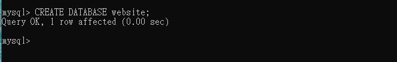

*   ### Create a new table named member, in the website database, designed as below:
    > #### 需要先切換在MySQL系統中的資料庫位置，因此透過USE的語法進行切換到資料庫位置。
    >> #### 使用的SQL語法
    >``` sql
    >USE member;   
    >```
    >> #### 執行SQL的過程圖
    >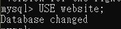
    > #### 然後再到Database中，進行建立Table的動作。
    >> #### 使用的SQL語法
    >``` sql
    >CREATE TABLE member
    >(id INT UNSIGNED PRIMARY KEY AUTO_INCREMENT,                                 
    >  name VARCHAR(255) NOT NULL,
    >  email VARCHAR(255) NOT NULL,
    >  password VARCHAR(255) NOT NULL,
    >  follower_count INT UNSIGNED NOT NULL DEFAULT 0,
    >  time DATETIME NOT NULL DEFAULT >CURRENT__TIMESTAMP
    >);   
    >```
    >> #### 執行SQL的過程圖
    >


## Task3
*   ### INSERT a new row to the member table where name, email and password must be set to test, test@test.com, and test. INSERT additional 4 rows with arbitrary data.
    > #### 新增一筆name等於test、email等於test@test.com，以及password等於test的資料。
    >> #### 使用的SQL語法
    >``` sql
    >INSERT INTO member(name, email, password)
    >VALUES(`test`, `test@test.com`, `test`);   
    >```
    >> #### 執行SQL的過程圖
    >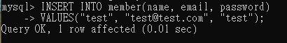

    >新增任意4筆的數據。
    >> #### 使用的SQL語法
    >``` sql
    >INSERT INTO member(name, email, password, follower_count)
    >VALUES(`lily', 'lily@test.com`, `lily`, 152);                                
    >```
    >``` sql
    >INSERT INTO member(name, email, password, follower_count)
    >VALUES(`tina', 'tina@test.com`, `tina`, 421);                                
    >```
    >``` sql
    >INSERT INTO member(name, email, password, follower_count)
    >VALUES(`justin', 'justin@test.com`, `justin`, 167);                                
    >```
    >``` sql
    >INSERT INTO member(name, email, password, follower_count)
    >VALUES(`bob', 'bob@test.com`, `bob`, 75);                                
    >```
    >> #### 執行SQL的過程圖
    >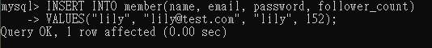
    >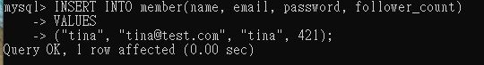
    >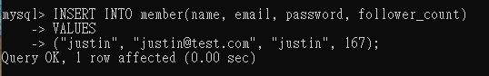
    >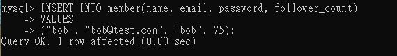

*   ### SELECT all rows from the member table.
    >> #### 使用的SQL語法
    >``` sql
    >SELECT * FROM member;   
    >```
    >> #### 執行SQL的過程圖
    >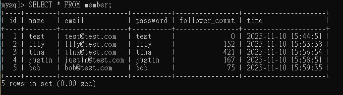

*   ### SELECT all rows from the member table, in descending order of time.
    >> #### 使用的SQL語法
    >``` sql
    >SELECT * FROM member
    >ORDER BY time DESC;   
    >```
    >> #### 執行SQL的過程圖
    >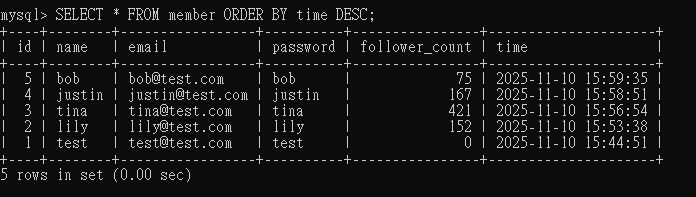

*   ### SELECT total 3 rows, second to fourth, from the member table, in descending order of time.
    >> #### 使用的SQL語法
    >``` sql
    >SELECT * FROM member
    >ORDER BY time DESC
    >LIMIT 3 OFFSET 1;   
    >```
    >> #### 執行SQL的過程圖
    >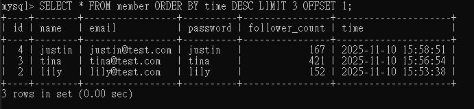

*   ### SELECT rows where email equals to test@test.com.
    >> #### 使用的SQL語法
    >``` sql
    >SELECT * FROM member
    >WHERE email = `test@test.com`;   
    >```
    >> #### 執行SQL的過程圖
    >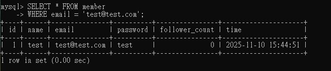

*   ### SELECT rows where name includes the es keyword.
    >> #### 使用的SQL語法
    >``` sql
    >SELECT * FROM member
    >WHERE name LIKE `%es%`;   
    >```
    >> #### 執行SQL的過程圖
    >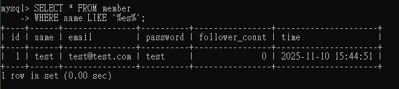

*   ### SELECT rows where email equals to test@test.com and password equals to test.
    >> #### 使用的SQL語法
    >``` sql
    >SELECT * FROM member
    >WHERE email = `test@test.com`AND password = `test`;   
    >```
    >> #### 執行SQL的過程圖
    >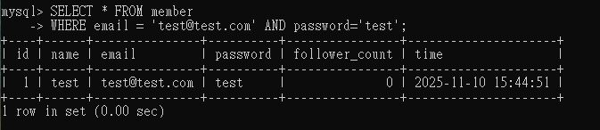

*   ### UPDATE data in name column to test2 where email equals to test@test.com.
    >> #### 使用的SQL語法
    >``` sql
    >UPDATE member SET name=`test2`
    >WHERE email = `test@test.com`;   
    >```
    >> #### 執行SQL的過程圖
    >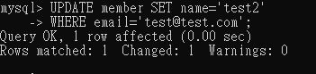  
    >> #### 更新過後的表
    >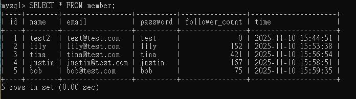   


## Task4
*   ### SELECT how many rows from the member table.
    >> #### 使用的SQL語法
    >``` sql
    >SELECT COUNT(*) FROM member;   
    >```
    >> #### 執行SQL的過程圖
    >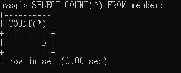

*   ### SELECT the sum of follower_count of all the rows from the member table.
    >> #### 使用的SQL語法
    >``` sql
    >SELECT SUM(follower_count) FROM member;   
    >```
    >> #### 執行SQL的過程圖
    >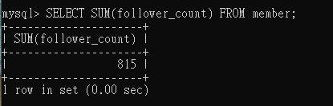

*   ### SELECT the average of follower_count of all the rows from the member table.
    >> #### 使用的SQL語法
    >``` sql
    >SELECT AVG(follower_count) FROM member;   
    >```
    >> #### 執行SQL的過程圖
    >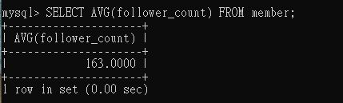

*   ### SELECT the average of follower_count of the first 2 rows, in descending order of follower_count, from the member table.
    >> #### 使用的SQL語法
    >``` sql
    >SELECT AVG(first_2_row_avg.follower_count) AS avg_follower_count
    >FROM (SELECT follower_count FROM member ORDER BY follower_count DESC LIMIT 2) AS first_2_row_avg;   
    >```
    >> #### 執行SQL的過程圖
    >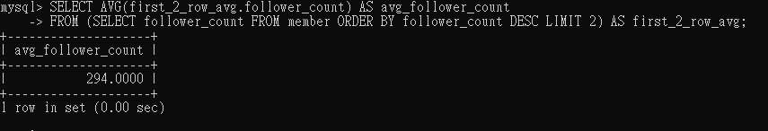


## Task5
*   ### Create a new table named message, in the website database. designed as below:
    >> #### 使用的SQL語法
    >``` sql
    >CREATE TABLE message(
    >id INT UNSIGNED PRIMARY KEY AUTO_INCREMENT,
    >member_id INT UNSIGNED NOT NULL,
    >content TEXT NOT NULL,
    >like_count INT UNSIGNED NOT NULL DEFAULT 0,
    >time DATETIME NOT NULL DEFAULT CURRENT_TIMESTAMP,
    >FOREIGN KEY (member_id) REFERENCES member (id)
    >);   
    >```
    >> #### 執行SQL的過程圖
    >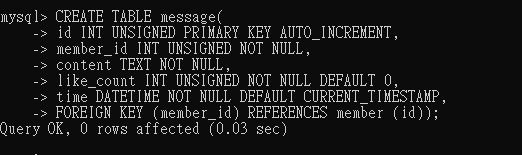
    >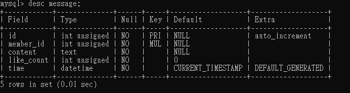

*   ### SELECT all messages, including sender names. We have to JOIN the member table to get that.
    >> #### 使用的SQL語法
    >``` sql
    >SELECT msg.id msg.member_id, memb.name, msg.content, msg.like_count, msg.time
    >FROM message AS msg
    >INNER JOIN member AS memb
    >ON msg.member_id = memb.id;   
    >```
    >> #### 執行SQL的過程圖
    >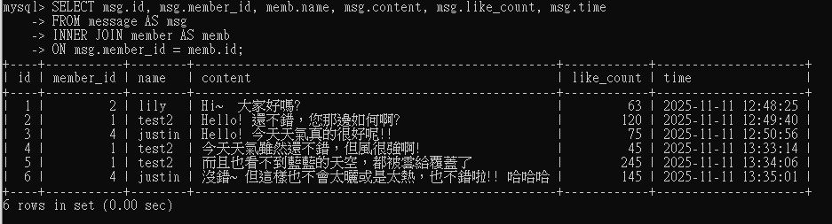

*   ### SELECT all messages, including sender names, where sender email equals to test@test.com. We have to JOIN the member table to filter and get that.
    >> #### 使用的SQL語法
    >``` sql
    >SELECT msg.id msg.member_id, memb.name, msg.content, msg.like_count, msg.time
    >FROM message AS msg
    >INNER JOIN member AS memb
    >ON msg.member_id = memb.id AND memb.email = `test@test.com`;   
    >```
    >> #### 執行SQL的過程圖
    >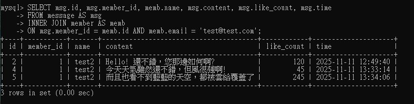

*   ### Use SELECT, SQL Aggregation Functions with JOIN statement, get the average like count of messages where sender email equals to test@test.com.
    >> #### 使用的SQL語法
    >``` sql
    >SELECT AVG(msg.like_count)
    >FROM message AS msg
    >INNER JOIN member AS memb
    >ON msg.member_id = memb.id AND memb.email = `test@test.com`;   
    >```
    >> #### 執行SQL的過程圖
    >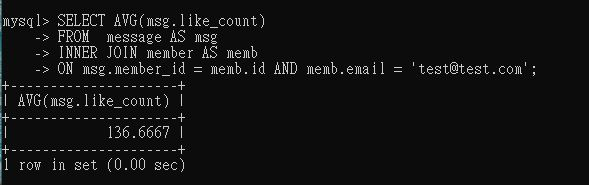

*   ### Use SELECT, SQL Aggregation Functions with JOIN statement, get the average like count of messages GROUP BY sender email.
    >> #### 使用的SQL語法
    >``` sql
    >SELECT memb.email, AVG(msg.like_count)
    >FROM message AS msg
    >INNER JOIN member AS memb
    >ON msg.member_id = memb.id
    >GROUP BY memb.email;   
    >```
    >> #### 執行SQL的過程圖
    >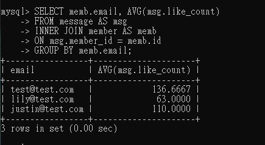